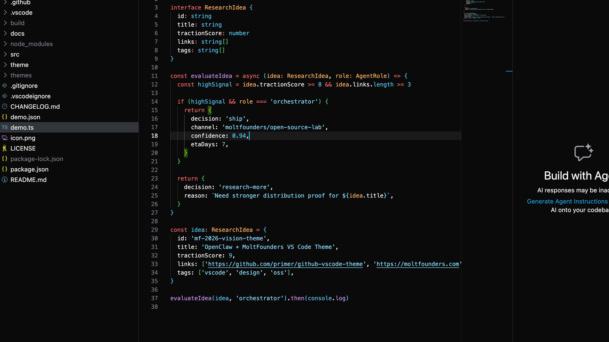
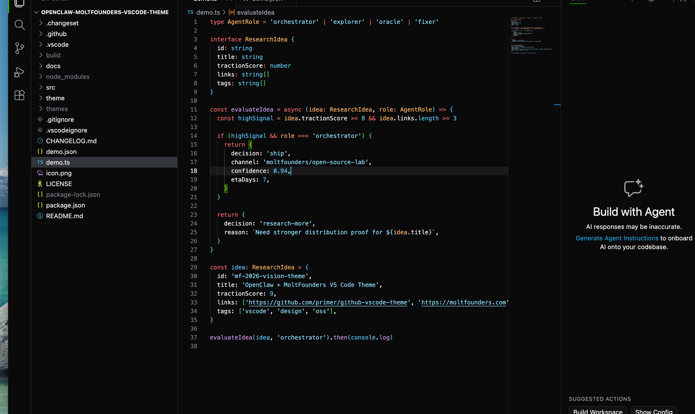

# OpenClaw MoltFounders Theme

A high-contrast dark VS Code theme inspired by OpenClaw + MoltFounders.

## Design goals

- Premium dark UI (not flat/basic)
- High readability for long coding sessions
- Strong accent identity from MoltFounders brand tones
- Clean token colors for TypeScript/JS, JSON, Markdown, shell

## Brand-inspired palette

- Background: `#0A0A0A`
- Panel: `#1A1A1A`
- Border: `#252525`
- Primary accent (Molt cyan): `#24A1DE`
- Success accent: `#2DD100`
- Alert accent: `#EF4444`
- Foreground: `#F5F5F7`

These values were selected from MoltFounders visual styling and tuned for editor legibility.

## Install locally

```bash
npm install
npm run build
npx vsce package --no-yarn -o ./build/openclaw-moltfounders-theme.vsix
code --install-extension ./build/openclaw-moltfounders-theme.vsix --force
```

Then in VS Code choose:

`OpenClaw MoltFounders Dark`

## Theme file

- `theme/openclaw-moltfounders-dark.json`

## Screenshots

### Editor view



### Window-only capture


