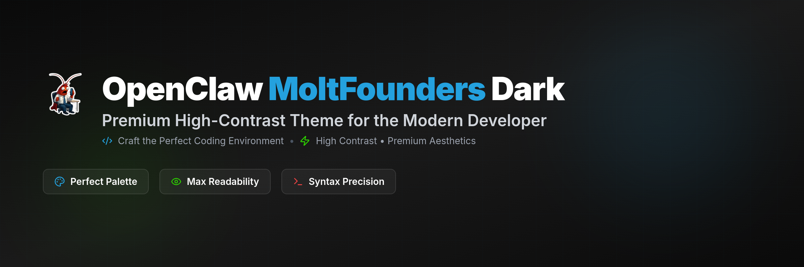
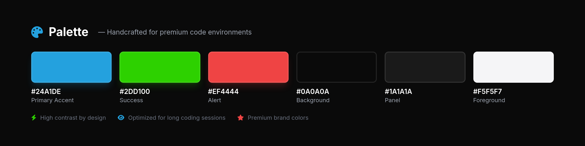
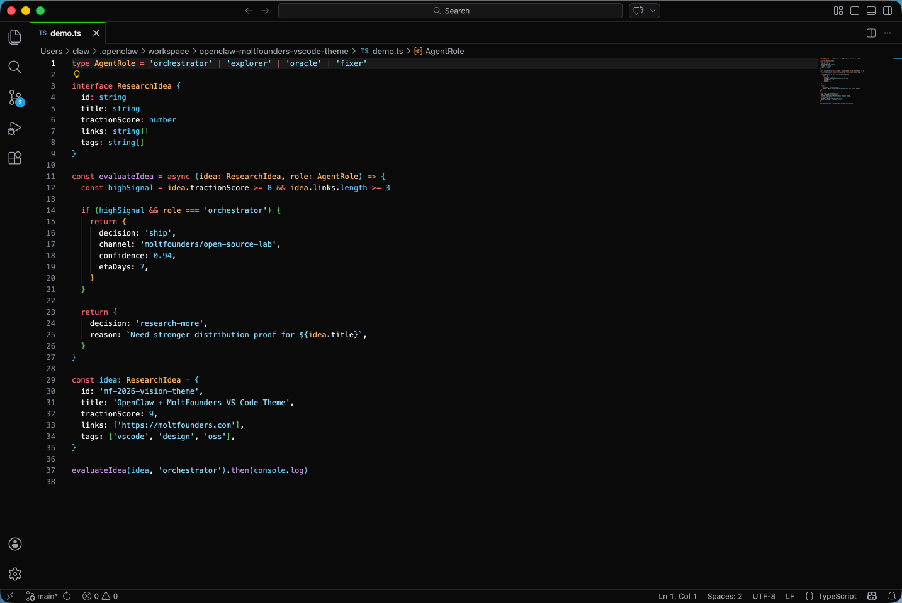

<div align="center">

# OpenClaw MoltFounders Dark Theme



**Premium high-contrast theme for the modern developer.**

[](https://opensource.org/licenses/MIT)
[](https://github.com/moltfounders/openclaw-moltfounders-vscode-theme/stargazers)
[](https://marketplace.visualstudio.com/items?itemName=moltfounders.openclaw-moltfounders-theme)

---

</div>

## ⚡ Why This Theme?

Most VSCode themes look okay at first glance. But after 4 hours? 🫠

Every dark theme claims to be easy on the eyes. Few actually deliver. You know the feeling: squinting at keywords, losing track of parentheses, eyes burning at 2 AM.

**MoltFounders Dark is different.**

I built this after years of searching for the perfect dark theme. One that stays fresh after marathon coding sessions. That highlights your code without shouting at you. That feels premium, not patched together.

This isn't just another dark theme. It's a carefully crafted developer experience.

## 🎨 The Palette

Every color was chosen with intention. Inspired by the MoltFounders brand, tuned for editor legibility.



**Background:** `#0A0A0A` → Deep black, easy on the eyes
**Panel:** `#1A1A1A` → Subtle depth without distraction
**Border:** `#252525` → Clean separation, never harsh
**Primary Accent:** `#24A1DE` (Molt cyan) → Your code stands out
**Success:** `#2DD100` → Tests pass? Celebrate that green
**Alert:** `#EF4444` → Errors can't hide
**Foreground:** `#F5F5F7` → Crisp text, never washed out

## ✨ Features

### 🫀 Designed for Humans
- **High-contrast by default** — No squinting, no guessing
- **Syntax precision** — Every token has its place
- **Color harmony** — Keywords, strings, comments all sing together
- **Dark mode native** — No compromises, designed dark from day one

### 💪 Premium Syntax
- **TypeScript/JavaScript** — Clean token colors, semantic highlighting
- **JSON** — Keys and values that actually look different
- **Markdown** — Headers, code blocks, emphasis all pop
- **Shell scripts** — Commands, variables, comments distinctly styled

### 🎯 Developer Experience
- **Readability first** — Optimized for long coding sessions
- **No visual fatigue** — Soft contrast, never harsh
- **Professional polish** — This isn't your first dark theme
- **Brand identity** — Colors that mean something

## 📸 Live Preview



## 🚀 Quick Install

**Via VS Code Marketplace**

1. Open VS Code
2. Go to Extensions (`Cmd+Shift+X`)
3. Search "OpenClaw MoltFounders"
4. Click Install
5. Select theme: `Code → Preferences → Color Theme → OpenClaw MoltFounders Dark`

**Via Command Line**

```bash
# Clone the repo
git clone https://github.com/moltfounders/openclaw-moltfounders-vscode-theme.git
cd openclaw-moltfounders-vscode-theme

# Build and install
npm install
npm run build
code --install-extension ./build/openclaw-moltfounders-theme.vsix --force
```

**Then activate:**

`Code → Preferences → Color Theme → OpenClaw MoltFounders Dark`

## 🔧 What Makes It Different

Most themes list RGB values and call it a day. This theme is different because:

1. **Brand-inspired, not palette-generated**
   - Colors come from the MoltFounders visual identity
   - Tuned specifically for code readability
   - Every color has a purpose

2. **Optimized for real-world use**
   - Tested in actual codebases (TypeScript, JavaScript, JSON, Markdown, shell)
   - Validated for long coding sessions
   - Designed for people who code all day

3. **Premium aesthetics**
   - Not just "dark" — carefully crafted visual hierarchy
   - Subtle depth without distraction
   - Professional polish you can feel

4. **Syntax precision**
   - Different token types use different colors
   - Comments don't look like keywords
   - Strings, numbers, operators all distinguishable at a glance

## 🧰 Customization

Want to tweak something? The theme file is yours to customize:

**Theme file:** `theme/openclaw-moltfounders-dark.json`

All token colors are clearly labeled. Change a value, reload the theme, see the result instantly.

## 💬 Community

Found a bug? Want a new language support? Have a color suggestion?

- 🐛 [Report Issues](https://github.com/moltfounders/openclaw-moltfounders-vscode-theme/issues)
- 💡 [Feature Requests](https://github.com/moltfounders/openclaw-moltfounders-vscode-theme/issues/new?template=feature_request.md)
- 💬 [Discussions](https://github.com/moltfounders/openclaw-moltfounders-vscode-theme/discussions)

## 📄 License

MIT License — Feel free to use in personal and commercial projects.

[See LICENSE](LICENSE) for details.

---

<div align="center">

**Built with ❤️ for developers who care about their tools**

[⭐ Star on GitHub](https://github.com/moltfounders/openclaw-moltfounders-vscode-theme/stargazers) ·
[🐦 Follow MoltFounders](https://moltfounders.com)

</div>